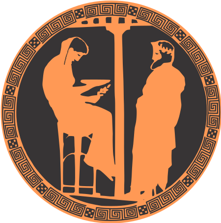

## PYTHIA8.jl
Julia bindings for the [PYTHIA](https://pythia.org) generator of high-energy physics collision events.

See the [documentation](https:///JuliaHEP.github.io/PYTHIA8.jl) for  the installation and basic usage.

